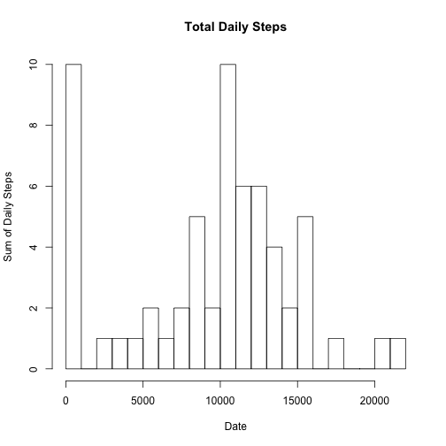
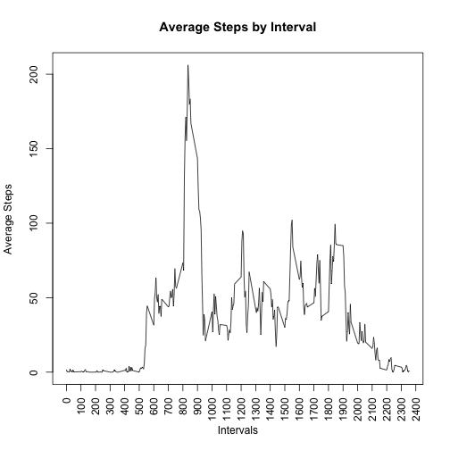
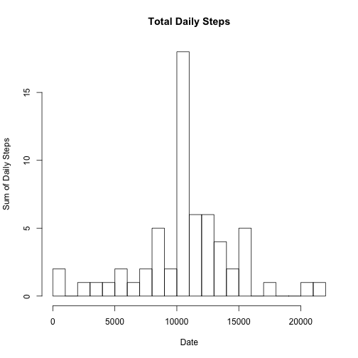
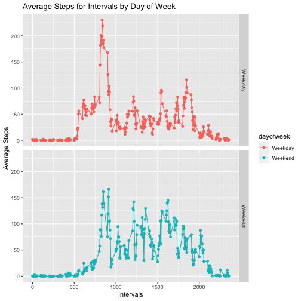

## Loading and preprocessing the data

### Loading the four required packages: dplyr, knitr, rmarkdown and ggplot2


```r
library(dplyr)
library(ggplot2)
library(knitr)
library(rmarkdown)
```

### Reading the csv file into a dataframe named activitydata


```r
activitydata<-read.csv('activity.csv',header = TRUE,na.strings = 'NA')
```

### The date variable is of class factor. Coverting it to class date


```r
activitydata$date<-as.Date(activitydata$date)
```


## What is mean total number of steps taken per day?

### The data is aggreagted by date an sum of steps is calculated using which the histogram is plotted


```r
## The data is aggreagted by date an sum of steps is calculated using which 
## the histogram is plotted

sumdailysteps<-aggregate(activitydata$steps,by=list(activitydata$date),sum,na.rm=TRUE)

## Names assigned to columns
names(sumdailysteps)<-c('date','sumdailysteps')

## Histogram code. Breaks = 20 used
hist(sumdailysteps$sumdailysteps,xlab = 'Date',ylab='Sum of Daily Steps',
          main='Total Daily Steps',breaks = 20)
```



### Mean and Median of the sum of number of steps recorded daily


```r
## Mean and Median of the sum of number of steps recorded daily

mean(sumdailysteps$sumdailysteps)
```

```
## [1] 9354.23
```

```r
median(sumdailysteps$sumdailysteps)
```

```
## [1] 10395
```
## What is the average daily activity pattern?

### Now the original data is aggregated to calculate the mean of number of steps by intervals


```r
## Now the original data is aggregated to calculate the mean of number of steps by intervals

averagebyinterval<-aggregate(activitydata$steps,by=list(activitydata$interval),mean,na.rm=TRUE)

## Names are assigned to columns
names(averagebyinterval)<-c('interval','average')

## Line type plot of the number of average steps take in each 5 minute interval
plot(averagebyinterval$interval,averagebyinterval$average,type='l',xlab = 'Intervals',
           ylab = 'Average Steps',main = 'Average Steps by Interval',xaxt='n')

## The x-axis limits are defined and labels are rotated
axis(1, at = seq(0, 3000, by = 100), las=2)
```



### The interval which contains the maximum number of steps, on an average


```r
## The interval with maximum average is identified
filter(averagebyinterval,averagebyinterval$average==max(averagebyinterval$average))
```

```
##   interval  average
## 1      835 206.1698
```

## Imputing missing values
### Total number of missing values in the steps column

```r
## Total number of missing values in the steps column
sum(is.na(activitydata$steps))
```

```
## [1] 2304
```
### Replicating the data to impute missing values

```r
nonmissingactivitydata<-activitydata
## Indexes from data where NA values are present
nasteps<-which(is.na(activitydata$steps))

## For the indexes identified above, the NA values in steps column are replaced by the
## average number of steps of the corresponding time interval
for(i in nasteps){
        
        nonmissingactivitydata$steps[i]<-
averagebyinterval$average[which(averagebyinterval$interval==nonmissingactivitydata$interval[i])]
}

## The new dataframe is aggregated on number of steps by date
sumnonmissingsteps<-aggregate(nonmissingactivitydata$steps,
                              by=list(nonmissingactivitydata$date),sum,na.rm=TRUE)

## Names assigned to columns
names(sumnonmissingsteps)<-c('date','sumdailysteps')
```

### Histogram of the new dataframe for total number of steps recorded daily


```r
## Histogram of the total number of daily steps as per the new data
hist(sumnonmissingsteps$sumdailysteps,xlab = 'Date',ylab='Sum of Daily Steps',
     main='Total Daily Steps',breaks = 20)
```



### Mean and Median of the total number of daily steps for the new data


```r
## Mean and Median of the total number of daily steps for the new data
mean(sumnonmissingsteps$sumdailysteps)
```

```
## [1] 10766.19
```

```r
median(sumdailysteps$sumdailysteps)
```

```
## [1] 10395
```

## Are there differences in activity patterns between weekdays and weekends?

### The line plots of the number of average steps for each 5 minute inteeval. Both for Weekdays and Weekends

```r
## The new dataframe with no missing values is mutated to add a new column 
## The new column identifies whether the date for each record is a Weekday or Weekend

nonmissingactivitydata<-mutate(nonmissingactivitydata,weekofday=
              ifelse(weekdays(nonmissingactivitydata$date) 
                     %in% c('Saturday','Sunday'),'Weekend','Weekday'))

## The data is aggregated for mean of number of steps by interval and weekofday column
averageintervalwday<-aggregate(nonmissingactivitydata$steps,
by=list(nonmissingactivitydata$interval,nonmissingactivitydata$weekofday),mean,na.rm=TRUE)

## Names are assigned to the columns
names(averageintervalwday)<-c('interval','dayofweek','meanofsteps')

## GGPlOT is used to plot 2 line graphs in a panel. Average number of steps are plotted against
## the interval for both Weekdays and Weekends. 
ggplot(averageintervalwday,aes(x=interval,y=meanofsteps,color=dayofweek)
       ,group=dayofweek)+geom_line()+geom_point()+facet_grid(dayofweek~.)+
        labs(title='Average Steps for Intervals by Day of Week')+
        xlab('Intervals')+
        ylab('Average Steps')
```


